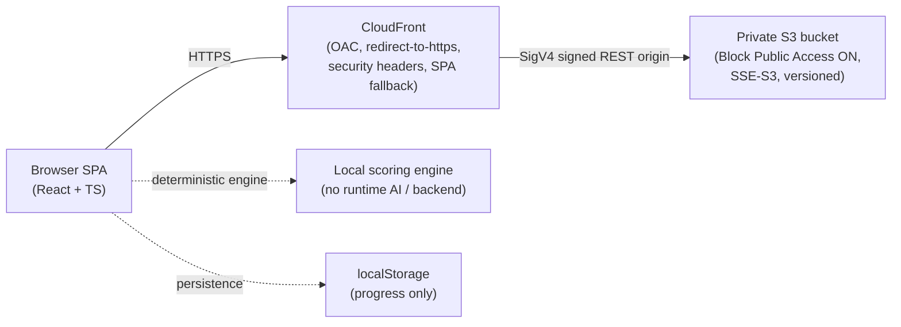

# AI-DLC Learning Simulator

[](https://d1s9ig7adbe2qs.cloudfront.net)

Human Review / Rework / Gate / Propagation / Completion / Release を体験するための、
決定的 (deterministic) な Learning Simulator です。ブラウザだけで完結します。

**Live Preview**: <https://d1s9ig7adbe2qs.cloudfront.net>

> このシミュレーターは **runtime AI / LLM で採点しているプロダクトではありません**。
> 評価はすべてローカルの決定的エンジンで行われ、同じ入力は常に同じ結果を返します。

## What this is

Agentic Development を題材にした教育用シミュレーターです。ユーザーは学習者として、
Agent が生成した Artifact（要件・設計・テスト戦略・エビデンスなど）を **人間としてレビューし、
どこで進め、どこで差し戻し、どのリスクを残したまま承認するか** を判断します。判断の結果は
決定的に評価され、後工程への伝播（propagation）や最終結果（Result）に反映されます。

runtime backend も runtime AI もありません。すべてブラウザ内のローカルエンジンで動作し、
ユーザー登録・DB・外部 AI API を一切使用しません。

## Why

Agentic Development では、コードを書くこと自体よりも
「**Agent が生成したものを人間がどうレビューし、いつ進め、いつ止め、どのリスクを残すか**」
が重要になります。このシミュレーターは、その Human-in-the-loop の判断そのものを
繰り返し練習できるようにすることを目的にしています。

## Core Learning Model

学習体験は次の一貫した流れをたどります。

```
Context → Artifact → Human Review → Decision → Rework / Propagation → Completion → Release → Result
```

- **Context**: Project Archetype と構造化入力（データ機密度・可用性要件・可逆性・承認要件など）で
  シナリオの前提を確定する。
- **Artifact**: その Context から決定的に Artifact が生成される（欠陥を仕込んだものを含む）。
- **Human Review**: 学習者が各 Artifact の項目を見て、どれが欠陥 (finding) かを指摘する。
- **Decision**: Approve / Approve with conditions / Return for rework / Change scope / Block を選ぶ。
- **Rework / Propagation**: 差し戻すと Agent が Rework し、上流の解決/未解決が直接下流へ伝播する。
- **Completion → Release**: 工程完了の承認と、リリース承認は **別のゲート**として扱う。
- **Result**: 配送の帰結（Journey Outcome）と学習者の判断品質（Learner Evaluation）を分けて提示する。

## Modes

Main Journey は 3 つの学習モードで体験できます。**評価の Ground Truth はモードで変わりません**
（モードは「いつ・何を・どれだけ提示するか」だけを変えます）。

- **Guided（ガイド付き学習）**: サンプルプロジェクトを使い、判断の前後に AI-DLC の概念を説明する。
  ヒント・provenance を多めに提示し、差し戻し方も案内する。初学者向け。
- **Simulation（シミュレーション）**: 自分の入力から始め、ヒントを減らして自力で判断する。
  重大な見逃しは次工程へ進む前に修正を求められる。
- **Adoption Review（導入レビュー）**: journey の途中では正誤を開示せず、見逃しを後工程へ実際に伝播させる。
  最後にまとめて振り返り、実チームへの導入検討に使う持ち帰り materials を得る。

これらとは別に **Training Gym**（練習の場）があります。これは 4 つ目のモードではなく、
Main Journey の結果から見えた弱点領域を、既存のフォーカス・シナリオやプラクティスで反復練習する
サーフェスです。本編を一度体験してから戻ると効果的です。

## Core Concepts

- **Artifact Rework**: Return for rework を選ぶと、その工程の Artifact を Agent が実際に作り直す。
  ラベルだけの「updated」ではなく、before/after の本文が構造的に変わる。
- **Revision**: 各工程のローカル改訂回数 (`localRevision`) と、Artifact 全体の identity である
  `artifactVersion` を区別する。content が変わるたびに `artifactVersion` が進む。
- **Finding lifecycle**: 欠陥 (defect) は unresolved → partial → resolved の多段階で解決しうる
  (binary な欠陥は unresolved → resolved の 2 状態)。
- **Root finding / downstream manifestation**: ある工程での見逃しが、後工程で別の形として顕在化する。
  顕在化した項目は「新しい採点対象」ではなく、前段の見逃しの結果として扱う。
- **Propagation**: 上流の解決/未解決が **直接隣接する下流工程 (1-hop)** の Artifact に決定的に伝播する。
- **Conditional Approval**: 「条件付き承認」を first-class な構造化データとして保持し、条件・必要証跡・
  検証時点を下流・Completion・Release・Result まで消えずに引き回す。
- **Residual Risk**: 残したリスクは Result まで追跡され、危険な承認判断は明示される。
- **Completion ≠ Release**: 工程完了の承認と（AWS 的な）リリース承認を別概念として区別する。
- **Human Gate**: 人間が Return / Block を選んだのに Product が無視して次へ進めることは、
  domain レベルの遷移規則で禁止されている（UI でボタンを隠すだけではない）。
- **Traceability**: 判断・見逃し・伝播・因果を結果画面までたどれる。

## Architecture

ブラウザ SPA を CloudFront + プライベート S3 origin で配信します。compute はありません。



- **Browser SPA**: React 18 + TypeScript + Vite。すべてのロジックはクライアントサイド。
- **Local deterministic engine**: 採点・伝播・結果はブラウザ内の純粋（pure）で決定的なエンジンが行う。
  runtime backend / runtime AI なし。
- **localStorage persistence**: 学習進捗のみをブラウザの localStorage に保存する（外部送信なし）。
- **CloudFront**: 唯一の公開面。HTTPS 強制、セキュリティヘッダー、SPA fallback。
- **Private S3 origin**: OAC (Origin Access Control) 経由でのみ読める非公開バケット。

## Project Structure

```
src/
  app/            アプリ状態・orchestration (use-journey-state など)
  domain/         決定的ドメインロジック
    journey/      Journey engine / artifact generator / propagation /
                  conditional approval / diff / gate transition / outcome など
  content/        Scenario / Archetype データ (JSON) とローダ・スキーマ
  data/           進捗の永続化 (progress-store, localStorage)
  i18n/           ja / en の表示文言
  ui/             画面コンポーネント
deploy/
  cloudformation/ 静的サイト配信の CloudFormation テンプレート
  README.md       デプロイ構成の詳細
scripts/          プロビジョニング / デプロイ / クリーンアップ スクリプト
aidlc/            AI-DLC の開発 Evidence（要件・設計・トレーサビリティ）
```

Scenario は JSON で管理し、アプリケーションロジックと Scenario データを分離しています。

## Local Development

前提: Node.js 20 系。

```bash
npm install      # 依存関係のインストール
npm run dev      # 開発サーバー起動 (Vite)
```

## Tests

```bash
npm test           # ユニットテスト (vitest run src/)
npm run test:coverage  # カバレッジ付き
```

At the RC6 release checkpoint, 500 tests passed. テスト数は今後の追加・整理で増減しうるため、
最新の実際の結果はローカルで `npm test` を実行して確認してください。

型チェック・Lint・ビルドは以下で確認できます。

```bash
npm run typecheck  # TypeScript 型チェック (tsc --noEmit, strict mode)
npm run lint       # ESLint (a11y ルールを含む)
npm run build      # 型チェック + プロダクションビルド
```

## Deployment

AWS 静的ホスティング（CloudFront + プライベート S3）へのデプロイ用スクリプトがリポジトリ root にあります。
詳細は [`deploy/README.md`](deploy/README.md) を参照してください。

```bash
scripts/provision-stack.sh   # CloudFormation スタックを作成/更新（インフラ）
scripts/deploy-preview.sh    # ビルド + アップロード + CloudFront invalidation
scripts/cleanup-preview.sh   # スタックとバケットを削除（破壊的・確認あり）
```

AWS のクレデンシャルは実行環境 / SSO / プロファイルから解決されます。アカウント固有情報や
プロファイル名などの個人固有情報は、このリポジトリには含めていません。

## Security

デプロイ構成 ([`deploy/cloudformation/static-site.yaml`](deploy/cloudformation/static-site.yaml)) は
以下を満たします。

- **Private S3 origin**: S3 Block Public Access を有効化（4 フラグすべて）。S3 website endpoint も
  public bucket policy もなし。
- **CloudFront + OAC**: バケットはこの CloudFront ディストリビューションからのみ（OAC + SigV4、
  `aws:SourceArn` スコープ）読める。
- **HTTPS**: CloudFront は HTTP→HTTPS にリダイレクトし、バケットポリシーは非 TLS リクエストを拒否する。
- **Security headers**: CloudFront の Response Headers Policy で CSP・HSTS・`X-Content-Type-Options`・
  `X-Frame-Options`・`Referrer-Policy` を HTTP レスポンスヘッダーとして配信する。
- **No AWS credentials in browser**: ブラウザに AWS クレデンシャルを持たせない。
- **No runtime secrets**: runtime のシークレットなし。テンプレート・スクリプトにアカウント id や
  クレデンシャルを含めない。
- **localStorage scope**: 永続化はブラウザの localStorage 内の学習進捗のみ。外部へ送信しない。

## Limitations

正直な制約として、以下を明記します。

- 教育用シミュレーターであり、実運用プロダクトではありません。
- Journey Step は **教育用の grouping** であり、公式 AI-DLC の Stage 名と 1:1 対応ではありません
  （対応は provenance / sourceConcept 参照で示します）。
- 評価は **決定的** です。自由記述の意味 (semantic) 評価は行いません。自由記述は保持・引用しますが、
  採点には使いません。
- Artifact は学習用に簡略化されています。
- runtime AI はありません。
- 永続化はブラウザ内 (localStorage) のローカル保存のみで、サーバー同期はありません。

## Live Preview

<https://d1s9ig7adbe2qs.cloudfront.net>

## License

[MIT-0 (MIT No Attribution)](LICENSE) — サンプル・シナリオ・実装を自由に再利用できます。
