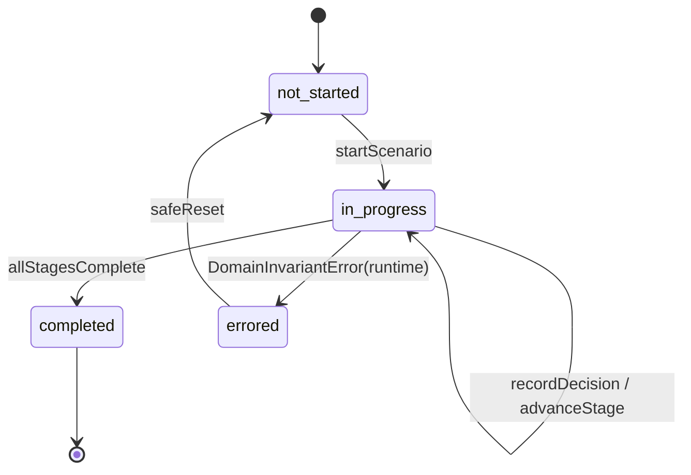
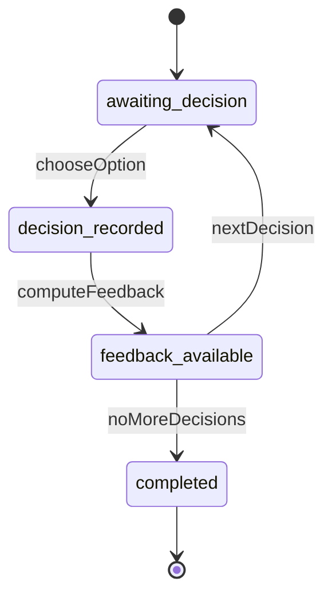
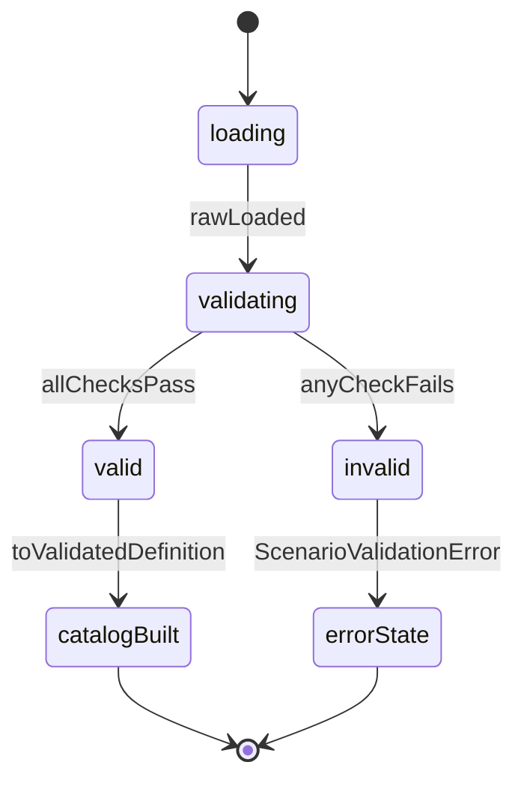
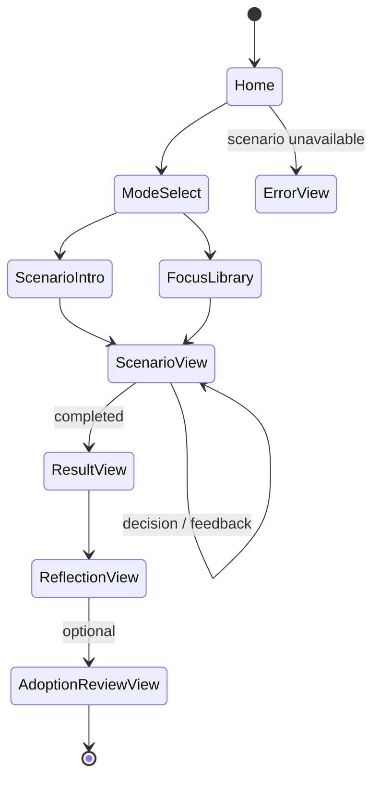
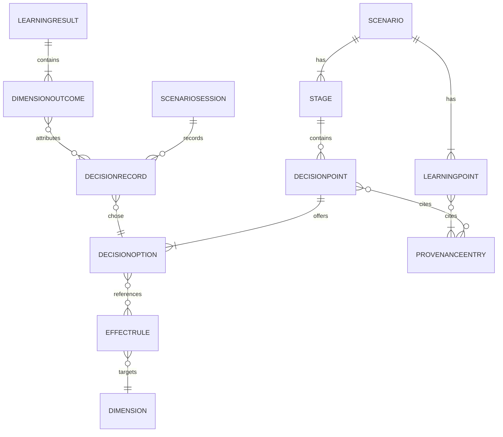

# Functional Spec — U1: aidlc-learning-simulator-web

> workflow と state machine の **source of truth**（`entities.md` はデータ shape、`rules.md` は決定ロジックの source of truth）。技術非依存。derived view として ER 図（entities.md 由来）と rules summary（rules.md 由来）を末尾に置く。Learning Target = AI-DLC v2.10.0。

## 1. 主要ユースケースの workflow（番号付きステップ）

### UC1: Core Guided Scenario 完走（約 5〜10 分）
1. ユーザーが Home でモードを選ぶ（既定 Guided）。
2. ExperiencePolicy が mode に応じた提示ポリシーを決める（評価は不変：BR5.2）。
3. ScenarioIntro で対象 core Scenario の概要を提示。
4. Stage を順に提示。各 Stage の DecisionPoint で選択肢（2..n）を提示。
5. ユーザーが DecisionOption を選択 → ScenarioProgression が DecisionRecord を記録（stable ID：BR2.3）。
6. Feedback を提示（LearningPoint / provenance の最小表示）。DecisionPoint が important なら provenance を確認可能にする（BR4.3）。
7. nextRef（省略時は次順 Stage）に従い次の DecisionPoint / Stage へ。全 Stage 完了で completed（BR2.1）。
8. DimensionEvaluator が DecisionRecord 列 + immutable context + EffectRules + ApprovalSemantics から 9 DimensionOutcome を決定的に算出（BR3.1/3.2/3.5）。
9. Result を提示（9 Dimension、寄与 rule と rationale で説明可能：BR3.7）。Reflection で振り返り。
10. 任意で Adoption Review へ進み Adoption Discussion Sheet（Markdown、決定的）を出力（BR7.1）。

### UC2: Focus Scenario 深掘り（時間制限なし）
1. Focus Scenario Library から focus Scenario を選ぶ。
2. 同一 Scenario Shell / Engine / ExperiencePolicy を再利用（別 engine を作らない：BR5.2）。
3. UC1 の step 4〜9 と同じ進行・評価を適用（core との差は kind と提示範囲のみ）。

### UC3: Simulation モード
1. ModeSelect で Simulation を選ぶ。
2. ExperiencePolicy が Simulation の提示（追加の探索/比較）を適用。評価 engine と data は共有（BR5.2）。
3. 進行・評価・結果は UC1 と同一の決定的パスを通る。

### UC4: 起動時 Scenario ロード・検証（ScenarioLoader）
1. build-time 同梱の各 ScenarioSet JSON を読み込む。
2. schema / unknown reject / stable-ID uniqueness / dangling reference / cardinality / provenance invariant / transition / supported schemaVersion を検証（BR1.1〜1.7）。
3. valid → validated immutable definition へ変換 → ApplicationOrchestrator 経由で ScenarioCatalog を構築。
4. 一部 invalid → 該当を利用可能一覧から除外し、どれを読めなかったか明示（BR1.8）。
5. 全 invalid → Application shell は起動し「Scenario unavailable」state を表示（BR1.8）。

### UC5: 進行の永続化・復元（ProgressStore）
1. 進行・結果・設定を stable-ID ベースで localStorage に保存（表示文言を保存しない：BR6.1）。
2. 再訪時に復元。persistenceSchemaVersion を検証（BR6.2）。
3. 非互換 → safe reset または明示 migration（silent coercion 禁止）。破損 → PersistenceError → domain へ渡さず safe reset・通知（BR6.3）。

## 2. State machine

### 2.1 ScenarioSession（domain lifecycle entity・source of truth。ScenarioProgression サービスが所有）

テキスト代替: 初期は not-started。開始で in-progress（currentStageId を data として保持）。decision 記録/stage 前進は in-progress 内で遷移。全 Stage 完了で completed。**runtime の invariant 違反（DomainInvariantError、ScenarioProgression 所有）でのみ errored** へ遷移する。errored からは safeReset で not-started へ戻せる。`currentStageId` は status ではなく in-progress state の data（BR2.1）。
> **error ownership の分離（ADR-011）**: この lifecycle の `errored` は **runtime の DomainInvariantError のみ**に限定する。**load 境界の ScenarioValidationError（ScenarioLoader 所有）は §2.3 の validation flow に閉じ**、lifecycle には持ち込まない（該当 Scenario はそもそも開始されない）。**PersistenceError は ProgressStore 所有**で復元時に safe reset を起点とする（BR6.3）。load boundary と runtime lifecycle の error を混在させない。

### 2.2 Decision workflow（DecisionPoint 単位）

テキスト代替: awaiting-decision で option 選択→decision-recorded→feedback-available→（次があれば awaiting-decision、無ければ completed）。BR2.4。

### 2.3 ScenarioLoader validation flow

テキスト代替: load→validate。全チェック通過で valid→validated definition→Catalog 構築。失敗で invalid→ScenarioValidationError→error presentation（該当 Scenario を開始しない、silent fallback なし）。BR1.1〜1.8。

## 3. UI view flow（presentation・domain と分離）

テキスト代替: Home→ModeSelect→（ScenarioIntro|FocusLibrary）→ScenarioView（decision/feedback ループ）→Result→Reflection→（任意）AdoptionReview。Scenario unavailable 時は ErrorView。view flow は presentation であり、domain の ScenarioSession state（2.1）とは分離（UI は domain logic を持たない：BR8.1）。

## 4. 評価の決定的算出（振る舞い仕様）
- 入力: DecisionRecord 列（順序と集合を明示）、immutable Scenario context、DecisionEffectRules、ApprovalSemantics。UI/locale/mode/time/random は入力にしない（BR3.1）。
- 手順: 各 DecisionRecord の chosenDecisionOptionId → effectRuleRefs → EffectRule（dimensionId, contribution 離散5段階, condition?）を、condition を評価しつつ Dimension ごとに決定的に畳み込む。DecisionRecord.note は採点入力に含めない（BR2.5/BR3.1）。
- 非単調 Dimension（delegation-quality / approval-boundary / risk-handling）は過少・過剰の双方を negative 側へ寄せる（BR3.4）。単調 Dimension はそのまま。
- 出力: 固定 9 DimensionOutcome（level + contributingDecisionRecordIds）。同一入力→同一結果、順序入替でも不変（BR3.2）。invariant 違反は DomainInvariantError（silent partial score なし：BR3.6）。

## 5. Derived views

### 5.1 ER 図（entities.md 由来・derived）

テキスト代替: Scenario は Stage と LearningPoint を持つ。Stage は DecisionPoint を含み、DecisionPoint は DecisionOption を提供。DecisionOption は EffectRule を参照し、EffectRule は Dimension を対象とする。DecisionPoint と LearningPoint は ProvenanceEntry を引用。runtime では ScenarioSession が DecisionRecord を記録し、DimensionOutcome は寄与 DecisionRecord を参照、LearningResult が 9 DimensionOutcome を持つ（すべて sessionId で紐づく）。（source of truth は entities.md の YAML）

### 5.2 Rules summary（rules.md 由来・derived）
| Group | 主題 |
|---|---|
| BR1 | Scenario 検証境界（fail-fast・reject・invariant） |
| BR2 | 進行 lifecycle・DomainInvariantError |
| BR3 | 決定的・Dimension 別非単調評価・説明可能性 |
| BR4 | provenance 4 区分・色非依存表示 |
| BR5 | i18n/mode 不変・翻訳欠落可視化 |
| BR6 | 永続化 stable-ID・safe reset |
| BR7 | Adoption 決定性・承認境界分離 |
| BR8 | UI 責務境界・runtime ID 決定性 |

（rule 本文の source of truth は rules.md の YAML）

## Sources
- consumes: `../../../inception/units-generation/unit-of-work.md`, `../../../inception/units-generation/unit-of-work-story-map.md`, `../../../inception/requirements-analysis/requirements.md`, `../../../inception/domain-design/components.md`, `../../../inception/contract-design/contract-summary.md`。
- 回答: `functional-design-questions.md`（Q1〜Q9）。source-of-truth 原則: Dimension≠Concept / authoring≠domain definition / semantic≠display / UI 非所有 / mode・locale は評価不変 / stable-ID は time-random 非依存 / Traceability != Verification / Completion Approval != Release Approval。
