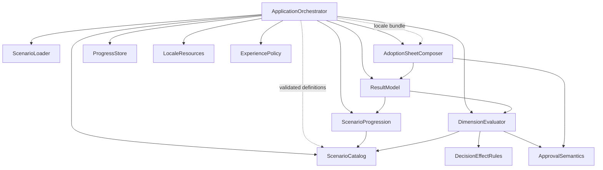

# Domain Design — Component Catalogue

> AI-DLC Learning Simulator（静的 React+TS+Vite SPA）。論理的 building block（＝書くコード）を特定する。infra/DB/ライブラリは components ではなく external_dependencies。Learning Target = AI-DLC v2.10.0。
> semantic model は UI 非依存。依存方向: UI/Application → domain ports/services → semantic model。data adapter は domain 定義の boundary へ変換する（hexagonal）。`/domain` は React / localStorage / UI library / locale 表示文字列 / raw JSON を直接参照しない。
> entity は ownership + shape レベル（所有・identifier・属性名・cross 参照）まで。型・制約・cardinality は Functional Design。

## Part A — machine-readable catalogue

```yaml
components:
  - name: ScenarioCatalog
    summary: authoring/source 側の semantic entity を所有する読み取り専用カタログ。
    behaviour: >
      validated Scenario 群を stable ID で保持し、ScenarioProgression / DimensionEvaluator に
      言語非依存の semantic data として供給する。表示文言は持たない（LocaleResources が別途保持）。
      Scenario / Stage / DecisionPoint / DecisionOption / LearningPoint と、
      各所の dimension-contribution-rule reference・provenance reference を所有する。
    responsibilities:
      - Scenario/Stage/DecisionPoint/DecisionOption/LearningPoint の所有と stable-ID による参照提供
      - DecisionEffectRules への rule reference、ProvenanceEntry への reference を保持
    depends_on: []
    behaviour_note: >
      ScenarioCatalog は raw JSON を直接読まない。ApplicationOrchestrator が起動時に ScenarioLoader の
      validated definitions を渡して初期化/構築する（Catalog は validated・immutable な semantic data のみを保持）。
    dependents:
      - component: ScenarioProgression
        interaction: 進行に必要な Stage/DecisionPoint/DecisionOption を stable ID で読む
      - component: DimensionEvaluator
        interaction: 評価に必要な immutable semantic context / rule reference を stable ID で読む
      - component: ApplicationOrchestrator
        interaction: ScenarioLoader の validated definitions で初期化・構築し、Scenario の取得・一覧を行う
    external_dependencies: []
    entities:
      - name: Scenario
        identifier: scenarioId
        attributes: [scenarioId, kind, learningObjectiveIds, stageIds, tags]
        references:
          - entity: ProvenanceEntry
            owned_by: ScenarioCatalog
            relationship: "各 Scenario / LearningPoint は 0..n の ProvenanceEntry を参照する"
      - name: Stage
        identifier: stageId
        attributes: [stageId, scenarioId, orderIndex, decisionPointIds, contextRef]
      - name: DecisionPoint
        identifier: decisionPointId
        attributes: [decisionPointId, stageId, isImportant, availableDecisionOptionIds, learningPointIds]
      - name: DecisionOption
        identifier: decisionOptionId
        attributes: [decisionOptionId, decisionPointId, decisionType, effectRuleRefs]
        references:
          - entity: DecisionEffectRule
            owned_by: DecisionEffectRules
            relationship: "各 DecisionOption は 0..n の DecisionEffectRule を参照する"
      - name: LearningPoint
        identifier: learningPointId
        attributes: [learningPointId, conceptId, provenanceRefs, betterAlternativeRef]
        references:
          - entity: ProvenanceEntry
            owned_by: ScenarioCatalog
            relationship: "重要 Decision の LearningPoint は provenance を必須で参照する"
      - name: ProvenanceEntry
        identifier: provenanceId
        attributes: [provenanceId, category, reference, note]
        references: []

  - name: ScenarioProgression
    summary: Scenario Session の純粋な進行ロジック（状態遷移）。
    behaviour: >
      validated Scenario を前提に Stage/Decision を進め、Return to Previous Stage / Change Scope を扱う。
      Decision 選択のたびに runtime の DecisionRecord を生成する。実行時の domain invariant guard を持ち、
      invalid transition / nonexistent next Stage / unavailable Decision / impossible runtime state を検出したら
      DomainInvariantError（= ScenarioRuntimeError）を返す（このコンポーネントが runtime invariant failure を所有）。
      決定的: 同一 Scenario・同一 Decision sequence は同一の遷移・同一の DecisionRecord 列を生む（乱数・時刻・順序非依存）。
    responsibilities:
      - Stage/Decision 進行の状態遷移と手戻り（Return / Change Scope）
      - runtime DecisionRecord の生成
      - runtime domain invariant guard と DomainInvariantError の発行
    depends_on:
      - component: ScenarioCatalog
        interaction: 進行に必要な semantic data を stable ID で読む
        style: sync
    dependents:
      - component: ApplicationOrchestrator
        interaction: セッション進行の駆動
      - component: ResultModel
        interaction: 生成された DecisionRecord を結果として渡す
    entities:
      - name: ScenarioSession
        identifier: sessionId
        attributes: [sessionId, scenarioId, currentStageId, status, decisionRecordIds]
      - name: DecisionRecord
        identifier: decisionRecordId
        attributes: [decisionRecordId, sessionId, decisionPointId, chosenDecisionOptionId, note, orderIndex]
        references:
          - entity: DecisionOption
            owned_by: ScenarioCatalog
            relationship: "各 DecisionRecord は選ばれた DecisionOption を stable ID で参照する"

  - name: DecisionEffectRules
    summary: Decision → Dimension contribution を表す決定的 data-driven rule set（UI 完全独立）。
    behaviour: >
      各 DecisionOption（および文脈条件）が 9 Dimension のどれにどう寄与するかを、
      class 量産でなく data-driven な rule として保持する。DimensionEvaluator がこれを読む。
      表示文字列を含まない（言語非依存）。同一入力に対し同一寄与を返す（決定的）。
    responsibilities:
      - Decision→Dimension 寄与ルールの data 化と提供
      - ルールの stable-ID 参照
    depends_on: []
    dependents:
      - component: DimensionEvaluator
        interaction: 評価時に適用する寄与ルールを読む
    entities:
      - name: DecisionEffectRule
        identifier: effectRuleId
        attributes: [effectRuleId, appliesToDecisionType, dimensionId, contributionDirection, conditionRef, rationaleRef]
        references:
          - entity: Dimension
            owned_by: DimensionEvaluator
            relationship: "各 rule は 1 つの Dimension への寄与を表す"

  - name: DimensionEvaluator
    summary: 9 Concept/Decision Dimension の決定的な multi-dimensional 評価（単一 score 中心ではない）。
    behaviour: >
      DecisionRecord 列（言語非依存 semantic data）、DecisionEffectRules、および ScenarioCatalog の
      validated・immutable な semantic context（Scenario / DecisionPoint / DecisionOption の semantic context、
      DecisionEffectRule の rule reference・context 条件）を入力に、各 Dimension の DimensionOutcome を決定的に算出する。
      ScenarioCatalog は immutable semantic data として read するため評価の決定性を崩さない。非単調評価: Human Intervention 過多も
      High Risk の過剰委任も「悪い」側に振れる。表示文字列を一切参照しない。UI に暗黙の評価ロジックを持たせない
      （評価は純関数 + rule/data で完結）。Requirement Clarity / Acceptance Criteria Coverage 等も
      9 Dimension の rule として内包（RequirementCoverage は独立コンポーネントにしない）。
      DimensionOutcome の id は乱数・時刻に依存せず、評価 semantic key + dimensionId 等から決定的に導出する（Runtime ID 決定性契約参照）。
      数値は Educational Simulation Value として実測値と区別する意味づけを持つ。
    responsibilities:
      - 9 Dimension の決定的評価と DimensionOutcome 算出
      - 各 Dimension 結果への寄与 DecisionRecord の追跡（説明可能性）
      - Dimension 定義（9 種）の所有・DimensionOutcome の owner/producer
    depends_on:
      - component: ScenarioCatalog
        interaction: 評価に必要な immutable semantic context（Scenario/DecisionPoint/DecisionOption semantic context・rule reference）を stable ID で read する
        style: sync
      - component: DecisionEffectRules
        interaction: 適用する寄与ルールを読む
        style: sync
      - component: ApprovalSemantics
        interaction: Approval Boundary / Delegation 系 Dimension の判定に承認意味論を参照
        style: sync
    dependents:
      - component: ApplicationOrchestrator
        interaction: 評価の実行
      - component: ResultModel
        interaction: DimensionOutcome を結果として渡す
    entities:
      - name: Dimension
        identifier: dimensionId
        attributes: [dimensionId, conceptKey]
      - name: DimensionOutcome
        identifier: dimensionOutcomeId
        attributes: [dimensionOutcomeId, dimensionId, sessionId, level, contributingDecisionRecordIds, isEducationalSimulationValue]
        references:
          - entity: DecisionRecord
            owned_by: ScenarioProgression
            relationship: "各 DimensionOutcome はどの DecisionRecord が寄与したかを参照する"

  - name: ApprovalSemantics
    summary: agent execution boundary / human-controlled approval gate / AI-DLC Completion Approval / Release Approval の意味論と判定。
    behaviour: >
      「実行可能範囲（boundary/Zone）」と「人の承認停止点（gate/Gate）」を別概念として判定する。
      AI-DLC 工程完了承認（Completion Approval）と（AWS/Production）Release Approval を別 semantic concept として扱い、
      前者が後者を含意しない不変を表現する。言語非依存。DimensionEvaluator が Approval 系 Dimension で参照する。
    responsibilities:
      - boundary と gate の区別・判定
      - Completion Approval と Release Approval の別概念としての判定
    depends_on: []
    dependents:
      - component: DimensionEvaluator
        interaction: Approval Boundary / Delegation Quality 等の判定に使用
      - component: AdoptionSheetComposer
        interaction: Boundary / Approval 情報の投影
    entities:
      - name: ApprovalKind
        identifier: approvalKindId
        attributes: [approvalKindId, kind]
      - name: BoundaryKind
        identifier: boundaryKindId
        attributes: [boundaryKindId, kind]

  - name: ResultModel
    summary: 実行結果側の semantic entity を所有する。
    behaviour: >
      LearningResult / RemainingRisk / Rework / Reflection projection を **所有（owner）** し、
      ScenarioProgression が生成・所有する DecisionRecord と DimensionEvaluator が生成・所有する DimensionOutcome を
      stable ID で **保持・参照（holder/reference）** する（owner と混同しない）。
      Result / Reflection 画面と AdoptionSheetComposer の入力になる。決定的。
      LearningResult / RemainingRisk / Rework の id は乱数・時刻に依存せず semantic key から決定的に導出する（Runtime ID 決定性契約参照）。
    responsibilities:
      - LearningResult / RemainingRisk / Rework / Reflection projection の owner
      - DecisionRecord（Progression 所有）/ DimensionOutcome（Evaluator 所有）の stable ID による holder/reference
    depends_on:
      - component: ScenarioProgression
        interaction: DecisionRecord を受け取る
        style: sync
      - component: DimensionEvaluator
        interaction: DimensionOutcome を受け取る
        style: sync
    dependents:
      - component: AdoptionSheetComposer
        interaction: Markdown 生成の入力
      - component: ApplicationOrchestrator
        interaction: 結果 projection の取得
    entities:
      - name: LearningResult
        identifier: learningResultId
        attributes: [learningResultId, sessionId, dimensionOutcomeIds, decisionRecordIds, remainingRiskIds, reworkIds, reflectionRef]
      - name: RemainingRisk
        identifier: remainingRiskId
        attributes: [remainingRiskId, learningResultId, descriptionRef, relatedDimensionId]
      - name: Rework
        identifier: reworkId
        attributes: [reworkId, learningResultId, causeRef, relatedStageId]

  - name: AdoptionSheetComposer
    summary: LearningResult / DecisionRecord / Adoption memo から決定的に Markdown（Adoption Discussion Sheet）を生成する pure service。
    behaviour: >
      指定見出し（Project Context / Requirements / Acceptance Criteria / Agent Delegation Boundary /
      Human Approval Boundary / Evidence Required / Testing Expectations / Remaining Risks /
      Team Discussion Points / Questions to Resolve Before Adoption）で Markdown を生成する。
      入力は semantic input（ResultModel / ApprovalSemantics 投影）と、ApplicationOrchestrator が LocaleResources から
      解決して渡す明示的な locale/input bundle。LocaleResources に直接依存しない（domain 純粋性・hexagonal 維持）。
      決定性: **same semantic input + same locale input → same Markdown**（乱数・時刻非依存）。
      ja/en で文章は変わっても、Sheet の section 構造・意味・順序は変えない。導入用 Educational Output と明示する文言を含む。
    responsibilities:
      - Adoption Discussion Sheet の決定的 Markdown 生成（semantic input + locale bundle から）
    depends_on:
      - component: ResultModel
        interaction: LearningResult / DecisionRecord を読む
        style: sync
      - component: ApprovalSemantics
        interaction: Boundary / Approval 情報を投影
        style: sync
    dependents:
      - component: ApplicationOrchestrator
        interaction: Sheet 生成の実行
    entities: []

  - name: ScenarioLoader
    summary: 唯一の raw external データ検証境界（/data 相当の port/adapter）。
    behaviour: >
      build-time 同梱の Scenario JSON を runtime schema validation → cross-reference / required-field validation
      → validated domain object へ変換する。失敗は fail-fast・readable error・silent fallback なし・
      malformed を正常 Scenario として開始しない。provenance invariant（category 別 required reference 等）も検証。
      この失敗種別 ScenarioValidationError を所有する。mid-scenario 不整合は本コンポーネントの責務にしない
      （runtime invariant は ScenarioProgression が所有）。
    responsibilities:
      - raw Scenario JSON の schema + cross-reference + provenance invariant 検証
      - validated Scenario definitions（domain object）への変換して返す（Catalog を直接構築しない）
      - ScenarioValidationError の発行
    depends_on: []
    dependents:
      - component: ApplicationOrchestrator
        interaction: 起動時に raw JSON をロード・検証させ、validated definitions を受け取る（Orchestrator がそれを Catalog へ渡す）
    external_dependencies:
      - name: Scenario JSON (build-time bundled)
        kind: other
        purpose: 検証対象の raw 教材データ
      - name: runtime schema validator (e.g. zod — 具体は functional-design)
        kind: other
        purpose: 境界での runtime validation
    entities: []

  - name: ProgressStore
    summary: 永続化の port/adapter（localStorage）。domain は localStorage を知らない。
    behaviour: >
      language / active mode / scenario progress / DecisionRecord / memo / completed scenarios /
      LearningResult / Adoption Review memo を保存・復元する。保存は表示文言でなく stable ID で行う。
      schemaVersion / parse・validation / corrupted state handling / safe reset / quota・write failure を扱い、
      これらの失敗種別 PersistenceError を所有する。domain object と localStorage JSON representation を同一視しない。
    responsibilities:
      - 進行・結果・設定の永続化と復元（stable ID ベース）
      - schemaVersion 管理・corrupted 処理・safe reset・PersistenceError の発行
    depends_on: []
    dependents:
      - component: ApplicationOrchestrator
        interaction: セッション状態の保存・復元
    external_dependencies:
      - name: Web Storage (localStorage)
        kind: other
        purpose: クライアント側永続化
    entities: []

  - name: LocaleResources
    summary: ja/en の表示テキストリソース（semantic data と分離）。
    behaviour: >
      Scenario 文言・UI 文言を stable ID → 言語別テキストで解決する。EvaluationEngine（DimensionEvaluator）は
      これを一切参照しない。翻訳欠落による undefined/片言語混在を防ぐ（欠落検出）。表示変更で評価・identity・
      traceability・persisted progress は変化しない。
    responsibilities:
      - stable ID から ja/en 表示テキストへの解決
      - 翻訳欠落の検出（undefined/片言語混在を出さない）
    depends_on: []
    dependents:
      - component: ApplicationOrchestrator
        interaction: 表示テキスト解決
    entities: []

  - name: ExperiencePolicy
    summary: Guided / Simulation / Adoption Review の 3 モードを同一 Engine/Data 上で表現する提示ポリシー（ModePolicy）。
    behaviour: >
      guidance amount / hint visibility / pre-decision support / post-decision explanation amount /
      reflection depth / adoption-oriented prompts を制御する。Scenario semantic data / Decision meaning /
      DecisionEffectRules / Evaluation logic / Dimension Outcome は変更しない。mode によって evaluation result を
      変えることは禁止。Adoption Review は追加 Reflection prompt を持つ。
    responsibilities:
      - モード別の提示パラメータ提供（評価に影響しない）
    depends_on: []
    dependents:
      - component: ApplicationOrchestrator
        interaction: モードに応じた提示制御
    entities:
      - name: ExperienceMode
        identifier: experienceModeId
        attributes: [experienceModeId, modeKey, guidanceLevel, hintVisibility, explanationDepth, reflectionDepth, adoptionPrompts]

  - name: ApplicationOrchestrator
    summary: /app のオーケストレーション層。ドメインサービスと port/adapter を組み合わせて体験フローを駆動する。
    behaviour: >
      起動時に ScenarioLoader へ raw JSON を検証させ、返された validated definitions で ScenarioCatalog を初期化/構築する。
      その後 ScenarioCatalog → ScenarioProgression → DimensionEvaluator → ResultModel → AdoptionSheetComposer の流れを組み立て、
      ProgressStore / LocaleResources / ExperiencePolicy / UI と接続する。AdoptionSheetComposer へは、LocaleResources から
      解決した locale text を明示的な locale/input bundle として渡す（Composer は LocaleResources に直接依存しない）。
      ドメインの純粋性を保ち、UI から domain ports/services のみを呼ぶ。Domain Error（Validation/Runtime/Persistence）を
      受けて UI へ presentation 用に橋渡しする（error presentation の起点。生成は各 boundary が所有）。
    responsibilities:
      - 体験フローのオーケストレーション
      - domain ports/adapter の結線と Domain Error の UI 橋渡し
    depends_on:
      - component: ScenarioLoader
        interaction: 起動時 Scenario ロード
        style: sync
      - component: ScenarioCatalog
        interaction: Scenario 取得
        style: sync
      - component: ScenarioProgression
        interaction: 進行駆動
        style: sync
      - component: DimensionEvaluator
        interaction: 評価実行
        style: sync
      - component: ResultModel
        interaction: 結果 projection
        style: sync
      - component: AdoptionSheetComposer
        interaction: Sheet 生成
        style: sync
      - component: ProgressStore
        interaction: 保存・復元
        style: sync
      - component: LocaleResources
        interaction: 表示テキスト解決
        style: sync
      - component: ExperiencePolicy
        interaction: モード別提示
        style: sync
    dependents: []
    entities: []
```

## Part B — human-readable view

### Component Diagram



テキスト代替: ApplicationOrchestrator が全コンポーネントを結線する。起動時に ScenarioLoader が raw JSON を検証し validated definitions を返し、Orchestrator がそれで ScenarioCatalog を初期化/構築する（Loader は Catalog を直接構築しない）。ScenarioProgression は Catalog を読み進行し DecisionRecord を生成。DimensionEvaluator は ScenarioCatalog の immutable semantic context・DecisionEffectRules・ApprovalSemantics を読み評価。ResultModel は Progression の DecisionRecord と Evaluator の DimensionOutcome を stable ID で保持・参照し、LearningResult/RemainingRisk/Rework を所有。AdoptionSheetComposer は Result と ApprovalSemantics の semantic input に、Orchestrator が LocaleResources から解決して渡す locale bundle を加えて Markdown を生成（Composer は LocaleResources に直接依存しない）。ProgressStore/LocaleResources/ExperiencePolicy は横断的 port。

### Component Summary

| Component | Purpose | Depends On | Dependents | Entities Owned |
|---|---|---|---|---|
| ScenarioCatalog | authoring semantic data 所有（Orchestrator が Loader の validated definitions で構築） | — | ScenarioProgression, DimensionEvaluator, App | Scenario, Stage, DecisionPoint, DecisionOption, LearningPoint, ProvenanceEntry |
| ScenarioProgression | 進行状態遷移 + runtime invariant guard | ScenarioCatalog | App, ResultModel | ScenarioSession, DecisionRecord |
| DecisionEffectRules | Decision→Dimension 寄与 data-driven rule | — | DimensionEvaluator | DecisionEffectRule |
| DimensionEvaluator | 9 Dimension 決定的評価 | ScenarioCatalog, DecisionEffectRules, ApprovalSemantics | App, ResultModel | Dimension, DimensionOutcome |
| ApprovalSemantics | boundary/gate/Completion/Release 判定 | — | DimensionEvaluator, AdoptionSheetComposer | ApprovalKind, BoundaryKind |
| ResultModel | 結果集約 entity を所有し DecisionRecord/DimensionOutcome を保持・参照 | ScenarioProgression, DimensionEvaluator | AdoptionSheetComposer, App | LearningResult, RemainingRisk, Rework |
| AdoptionSheetComposer | 決定的 Markdown 生成（semantic input + locale bundle） | ResultModel, ApprovalSemantics | App | — |
| ScenarioLoader | 唯一の外部データ検証境界（validated definitions を返す） | — | App | — |
| ProgressStore | localStorage port/adapter | — | App | — |
| LocaleResources | ja/en 表示テキスト | — | App | — |
| ExperiencePolicy | 3 モード提示ポリシー | — | App | ExperienceMode |
| ApplicationOrchestrator | /app オーケストレーション | 全 domain/adapter | — | — |

### Entity Ownership

| Entity | Owning Component | Identifier | Attributes | References |
|---|---|---|---|---|
| Scenario | ScenarioCatalog | scenarioId | kind, learningObjectiveIds, stageIds, tags | ProvenanceEntry |
| Stage | ScenarioCatalog | stageId | scenarioId, orderIndex, decisionPointIds, contextRef | — |
| DecisionPoint | ScenarioCatalog | decisionPointId | stageId, isImportant, availableDecisionOptionIds, learningPointIds | — |
| DecisionOption | ScenarioCatalog | decisionOptionId | decisionPointId, decisionType, effectRuleRefs | DecisionEffectRule |
| LearningPoint | ScenarioCatalog | learningPointId | conceptId, provenanceRefs, betterAlternativeRef | ProvenanceEntry |
| ProvenanceEntry | ScenarioCatalog | provenanceId | category, reference, note | — |
| ScenarioSession | ScenarioProgression | sessionId | scenarioId, currentStageId, status, decisionRecordIds | — |
| DecisionRecord | ScenarioProgression | decisionRecordId | sessionId, decisionPointId, chosenDecisionOptionId, note, orderIndex | DecisionOption |
| DecisionEffectRule | DecisionEffectRules | effectRuleId | appliesToDecisionType, dimensionId, contributionDirection, conditionRef, rationaleRef | Dimension |
| Dimension | DimensionEvaluator | dimensionId | conceptKey | — |
| DimensionOutcome | DimensionEvaluator | dimensionOutcomeId | dimensionId, sessionId, level, contributingDecisionRecordIds, isEducationalSimulationValue | DecisionRecord |
| ApprovalKind | ApprovalSemantics | approvalKindId | kind | — |
| BoundaryKind | ApprovalSemantics | boundaryKindId | kind | — |
| LearningResult | ResultModel | learningResultId | sessionId, dimensionOutcomeIds, decisionRecordIds, remainingRiskIds, reworkIds, reflectionRef | — |
| RemainingRisk | ResultModel | remainingRiskId | learningResultId, descriptionRef, relatedDimensionId | — |
| Rework | ResultModel | reworkId | learningResultId, causeRef, relatedStageId | — |
| ExperienceMode | ExperiencePolicy | experienceModeId | modeKey, guidanceLevel, hintVisibility, explanationDepth, reflectionDepth, adoptionPrompts | — |

> ProvenanceEntry は ScenarioCatalog が所有するが **shared semantic value object** として Scenario/LearningPoint（authoring）と Result 投影（説明表示）双方から参照される。stable ID は全 entity で表示文言と独立。

### External Dependencies

| Component | Dependency | Kind | Purpose |
|---|---|---|---|
| ScenarioLoader | Scenario JSON (build-time bundled) | other | 検証対象の raw 教材データ（ScenarioCatalog は raw JSON を直接読まない。Orchestrator が validated definitions を渡す） |
| ScenarioLoader | runtime schema validator (zod 等、functional-design で確定) | other | 境界での runtime validation |
| ProgressStore | Web Storage (localStorage) | other | クライアント側永続化 |

### Rationale

| Component / 判断 | なぜ別 building block か |
|---|---|
| ScenarioCatalog vs ResultModel | 変更理由が異なる（authoring データ vs 実行結果）。データ所有と結果所有を分離し、評価の純粋性を保つ |
| DecisionEffectRules（分離） | Decision→Dimension 寄与は data-driven に変化しやすい。評価ロジックから rule/data を分離し class 量産を避ける（NFR5, FR5.4.2） |
| DimensionEvaluator（RequirementCoverage 非分離） | 単一 score でなく multi-dimensional。Requirement Clarity/AC Coverage は 9 Dimension の rule に内包し過度な細分化を避ける |
| ApprovalSemantics（分離） | boundary≠gate、Completion≠Release は本 Simulator 中核の学習概念。意味論を独立させ混同を防ぐ（v2.10.0） |
| ScenarioLoader（唯一境界） | 外部データ検証を一元化し重複を避ける。runtime invariant は Progression が別途所有 |
| ProgressStore（port/adapter） | domain を localStorage 非依存に保つ（hexagonal）。domain object ≠ 保存 JSON |
| LocaleResources（分離） | ja/en で評価結果を変えないため、意味データと表示テキストを分離。EvaluationEngine は表示を参照しない |
| ExperiencePolicy（分離） | モードは提示のみに影響し評価を変えない。同一 Engine/Data 共有を構造で保証 |
| ApplicationOrchestrator（/app） | 依存方向を一方向に保ち、UI と domain の結合を orchestration に閉じ込める |

**Alternatives Rejected**（詳細は decisions.md）: (a) Scenario と評価を単一コンポーネントに同居 → 変更理由の混在・決定性の検証困難で却下。(b) Decision ごとに評価 class 生成 → 保守性低下で却下（data-driven rule に）。(c) mode ごとに別 Engine → 同一評価保証が崩れるため却下（ExperiencePolicy に）。(d) 各コンポーネントが自前で localStorage/検証 → 重複・境界曖昧化で却下。

## Domain Error 所有（boundary 別）

| Error 種別 | 所有 boundary | 例 |
|---|---|---|
| ScenarioValidationError | ScenarioLoader/Validator | malformed JSON / schema violation / invalid reference / required field missing / provenance invariant violation |
| ScenarioRuntimeError（DomainInvariantError） | ScenarioProgression | invalid transition / nonexistent next Stage / unavailable Decision / impossible runtime state / validated Scenario 内の実行時不整合 |
| PersistenceError | ProgressStore | corrupted persisted state / schema version mismatch / quota・write failure |

> 型詳細（discriminated union 等）は Functional Design。Domain Design では「どの boundary がどの failure を所有するか」を固定。error presentation は ApplicationOrchestrator/UI が担う。

## Stable ID contract
Scenario / Stage / DecisionPoint / DecisionOption / LearningPoint / ProvenanceEntry / Dimension は表示文言と独立した stable ID（authoring stable ID）を持つ。**same semantic IDs + same Decision sequence → same evaluation result**。ja/en の表示変更・翻訳修正で Decision identity / evaluation / traceability / persisted progress は変化しない。localStorage には表示文言でなく stable ID を保存する。

## Runtime-generated ID 決定性契約（NFR2）
runtime で生成される entity の id は **決定的に導出**し、`Date.now()` / `Math.random()` / ランダム UUID に依存させない:
- **DecisionRecord id** = scenario/session semantic key + decisionPointId + occurrence index から導出。
- **DimensionOutcome id** = evaluation semantic key + dimensionId から導出。
- **LearningResult / RemainingRisk / Rework id** = 上記 semantic key（session/dimension/decision）から導出。
same semantic input（同一 Scenario・同一 Decision sequence・同一 mode-非依存 semantic data）→ 同一 id・同一結果。具体アルゴリズム（ハッシュ/連結規則）は Functional Design で確定。UI/diagnostic 用途の非決定的な run-correlation id が必要な場合は **domain semantic result とは分離**し、evaluation や golden test 結果へ影響させない。

## Sources
- consumes: `../requirements-analysis/requirements.md`（FR/NFR, v2.10.0）, `../user-stories/stories.md`（US1.1〜US8.2）, `../practices-discovery/team-practices.md`（Code Style レイヤー境界）。
- design knowledge: ddd-patterns（bounded context / aggregate / value object / repository・port）, architecture-guide, adr-template。
- refined-mockups 申し送り: 11 の意味論不変、UI 非依存 semantic model。

## Assumptions & Open Questions
- OQ（Functional Design）: 各 entity の型・制約・cardinality、Domain Error の TS 型、DecisionEffectRule の条件表現、ProvenanceEntry の reference 具体構造（sourceRefs schema）。
- OQ（Units Generation）: これらコンポーネントを deployable unit へどうグルーピングするか（本 SPA は単一 static bundle 想定だが Units Generation が確定）。
- None（本ステージのコンポーネント境界・entity 所有に未解決はなし。上記は下流委譲）。
