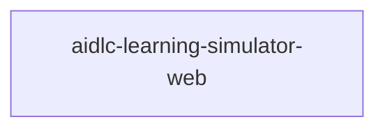

# Unit of Work — Dependency DAG

> topology のみ。実装順序・critical path は Delivery Planning が決める。deployable unit は 1 つなので DAG は単一ノード。

## Dependency DAG（unit 間）

deployable unit は U1 のみ。unit 間依存は無い（単一ノード、辺なし、cycle-free）。



テキスト代替: ノードは U1（aidlc-learning-simulator-web）1 つのみ。他 unit への依存辺は無い。

**注意**: Domain Design の 12 component 間の依存（例: DimensionEvaluator → ScenarioCatalog/DecisionEffectRules/ApprovalSemantics、ResultModel → ScenarioProgression/DimensionEvaluator）は **unit の依存ではなく、U1 内部の module/component dependency** である。ここ（unit DAG）には再表現しない。内部アーキテクチャの依存は `../domain-design/components.md` を正とする。

## Integration points between units

なし（unit は 1 つ。統合は U1 内部の module 間 API で、Domain Design の component 契約に従う。unit をまたぐ API/shared data/events は存在しない）。

## Parallel development opportunities

unit レベルの並行性は無い（単一 unit）。実装上の並行開発余地は U1 内部の implementation work unit（domain / data / ui / i18n 等、unit-of-work.md 参照）レベルで存在し、その順序・並行度は Delivery Planning が決める。

## Machine-readable edge block

```yaml
units:
  - name: aidlc-learning-simulator-web
    kind: ui
    depends_on: []
```

- 単一 unit、`depends_on: []`（依存なし）。
- 名前は lowercase path-segment identifier（`aidlc-learning-simulator-web`）。
- 自己依存なし、未宣言 unit 参照なし、cycle-free（自明）。
