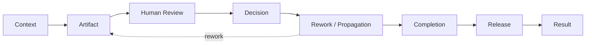
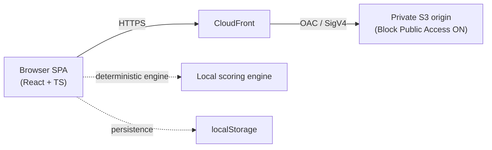

# AI-DLC Learning Simulator v1.0.0
# Release Evidence

このドキュメントは v1.0.0 リリースの検証可能な事実を記録する公開 Evidence です。
数値・状態はリリースチェックポイント時点で確認できたものだけを記載し、確認できないものは
`UNKNOWN` / `NOT RECORDED` と明記します。

## Release Identity

| 項目 | 値 |
| --- | --- |
| Version | `v1.0.0` |
| Commit | `3c0e65d92eb3a4aabae6e4ec3a0ce2d10cb9de82` |
| Repository | <https://github.com/nobu-13/aidlc-learning-simulator> |
| Release | <https://github.com/nobu-13/aidlc-learning-simulator/releases/tag/v1.0.0> |
| Live Preview | <https://d1s9ig7adbe2qs.cloudfront.net> |

`v1.0.0` の annotated tag はリリースチェックポイント commit `3c0e65d` を指します。

## Purpose

AI-DLC における以下の Human-in-the-loop の判断を体験するための、決定的 (deterministic) な
Learning Simulator です。

- Artifact Review
- Human Gate
- Return for Rework
- Revision
- Propagation
- Conditional Approval
- Residual Risk
- Completion Approval
- Release Approval

> このシミュレーターは **runtime AI / LLM が実行時に採点しているプロダクトではありません**。
> 評価はすべてブラウザ内のローカルで決定的に行われ、同じ入力は常に同じ結果を返します。

## Product Capabilities

Main Journey は 3 つの学習モードで体験できます。評価の Ground Truth はモードで変わりません
（モードは「いつ・何を・どれだけ提示するか」だけを変えます）。

- **Guided** — サンプルプロジェクトで概念を先出ししながら学ぶ。
- **Simulation** — 自分の入力から始め、ヒントを減らして自力で判断する。
- **Adoption Review** — journey 中は正誤を開示せず、見逃しを後工程へ伝播させ、最後に振り返る。

**Training Gym** は上記 3 モードと並ぶ 4 つ目の Journey mode ではありません。Main Journey の結果から
見えた弱点領域を反復練習するための **補助練習サーフェス (practice surface)** です。

## Core State Model



補足となる区別:

- **Root Finding → Downstream Manifestation**: ある工程での見逃し (root finding) は、後工程で別の形として
  顕在化 (downstream manifestation) する。顕在化した項目は「新しい採点対象」ではなく、前段の見逃しの結果として扱う。
- **Journey Outcome ≠ Learner Evaluation**: 配送 (delivery) の帰結（承認された / 止まった / 差し戻された）と、
  学習者の判断品質は別概念。正しく Block した場合、Journey Outcome は "blocked" でも Learner Evaluation は "strong" になりうる。
- **Completion ≠ Release**: 工程完了の承認と、（AWS 的な）リリース承認は別のゲートとして扱う。
- **Conditional Approval の伝播**: 条件付き承認は open condition として保持され、
  `Downstream → Completion → Release → Result` まで消えずに引き回される。

## Engineering Verification

RC6 release checkpoint（= v1.0.0）時点で確認した結果:

- 54 test files
- 500 tests passed
- TypeScript typecheck: PASS
- ESLint: PASS
- production build: PASS

> これは **RC6 release checkpoint 時点** の値です。テスト数は今後の追加・整理で増減しうるため、
> 最新の実際の結果はローカルで `npm test` を実行して確認してください。

## Deployment Architecture



- Browser SPA → CloudFront → OAC → private S3。
- Local deterministic engine + localStorage persistence。
- Runtime backend なし。Runtime AWS credentials なし。Runtime secrets なし。

## Security Verification

Live Preview の実 HTTP response で確認したセキュリティヘッダー（リリースチェックポイント時点）:

| Header | Value |
| --- | --- |
| Strict-Transport-Security | `max-age=31536000; includeSubDomains` |
| Content-Security-Policy | `default-src 'self'; connect-src 'self'; img-src 'self' data:; style-src 'self' 'unsafe-inline'; script-src 'self'; object-src 'none'; base-uri 'self'; frame-ancestors 'none'` |
| X-Content-Type-Options | `nosniff` |
| X-Frame-Options | `DENY` |
| Referrer-Policy | `no-referrer` |

`frame-ancestors 'none'` は `<meta http-equiv>` 経由では多くのブラウザが無視するため、
**CloudFront の HTTP response header** として配信することで実効的な clickjacking 防御になっています。
本 Preview では CSP が HTTP response header として返っていることを確認済みです。

## Independent Product Verification

自動テストに加えて、実装コンテキストを持たない立場からの独立検証を行いました
（これは追加の independent verification であり、「AI が品質保証した」という主張ではありません）。

- 実装コンテキストとは分離した blind product audit を実施（GPT ベースの reviewer / 複数 reviewer による blind audit）。
- reviewer は source / tests / known issues を先に見ず、live Preview を実際に操作した体験を source of truth とした。
- 各 reviewer は isolated browser context（fresh profile）で操作した。
- reproducible な minority finding を多数決で棄却しない方針。
- audit 間で意見が割れた finding は、targeted browser reproduction で裁定した。
- final release adjudication 時点で、reproducible な **P0 / P1 release blocker = 0**。

## Targeted Release Adjudication

意見が割れた 2 件の finding を、fresh browser profile から再現して裁定しました。

- Root Finding Identity: **PASS**
- Evidence Semantics: **PASS**
- 各 finding は isolated browser context で 2 回検証。
- 裁定中に Product code は変更していない。

## Reproducibility

リポジトリに実在する command のみを記載します。

Local:

```bash
npm install       # 依存関係
npm run dev       # 開発サーバー (Vite)
npm test          # ユニットテスト (vitest run src/)
npm run typecheck # tsc --noEmit (strict mode)
npm run lint      # ESLint (a11y ルールを含む)
npm run build     # typecheck + production build
```

Deployment（`deploy/README.md` 参照）:

```bash
scripts/provision-stack.sh   # CloudFormation スタックの作成/更新
scripts/deploy-preview.sh    # build + S3 sync + CloudFront invalidation
scripts/cleanup-preview.sh   # スタックとバケットの削除（破壊的・確認あり）
```

## Known Limitations

Product contract 上重要な制約のみ:

- 評価は決定的 (deterministic evaluation)。
- runtime AI なし。
- 自由記述の semantic scoring なし（自由記述は保持・引用するが採点しない）。
- Artifact は学習用に簡略化されている。
- 永続化はブラウザ localStorage のローカル保存のみ。
- production build 時に bundle-size advisory（chunk size warning）が出る（機能に影響なし）。
